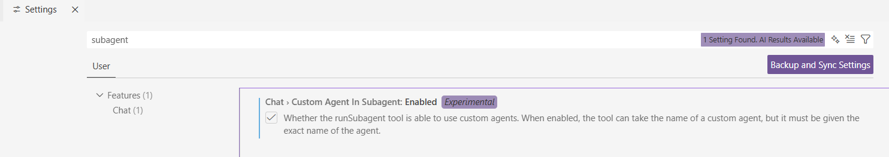
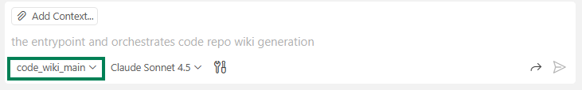

# Code Wiki by Multi-Agents
Inspired by [deepwiki.com](https://deepwiki.com/) and [deepwiki-open](https://github.com/AsyncFuncAI/deepwiki-open).
This project automatically generates comprehensive wiki documentation for private code repositories using multiple AI agents. The multi-agent system collaboratively analyzes your codebase to produce structured, accurate, and insightful documentation.

## Overview

The wiki generation follows a multi-agent pipeline:

1. **`code_wiki_main`** (Orchestrator)
   - Analyzes the repository structure
   - Creates an orchestration plan
   - Coordinates other agents
   - Saves analysis to `wiki/analysis/repository-analysis.json`

2. **`code_wiki_worker`** (Component Documenter)
   - Generates detailed documentation for individual components
   - Creates markdown files in `wiki/<component>.md`

3. **`code_wiki_reflector`** (Assembler)
   - Reviews and assembles all component documentation
   - Creates the final `wiki/Architecture.md` overview


## How to Use

### Quick Start
1. **Enable 'runSubagent' for Github copilot custom agents** in VS Code, such as shown below:
   
2. **Copy agent files to your repository**:
   - Copy the `.github/agents/` and `wiki` folders into your target code repository
   
      The files structure in your code repository would look like this:
      ```
      /
      src/
      .github/
      └── agents/
         ├── code_wiki_main.agent.md
         ├── code_wiki_reflector.agent.md
         └── code_wiki_worker.agent.md
      wiki/
      └── config/
         └── config.json
      ```
   
   - Optionally edit `wiki/config/config.json` to customize file exclusions
   
3. **Open your repository** in VS Code with GitHub Copilot enabled

4. **Invoke the wiki generator agent** in Copilot Chat:

   - Select and use the custom agent `code-wiki-main` in Copilot Chat
     
   - Use the prompt, such as
      ```
      Generate wiki documentations for this repository
      ```
   - In chat console, at `Step 3/6: User confirmation required`, you will be **ASKED IF** to proceed with full code repo and components wiki generation: 
  
     - **Reply `Yes` to continue**.

         > **📊 Cost Note**: Depending on your repository size, the full wiki generation process typically consumes **1-2% of your monthly Copilot premium requests**.

     - **Reply `NO` to pause** the process, but get Code Repo analysis JSON file available in `wiki/analysis/`,  
       - It can be used for `Specific Component Documentation Generation`.


5. Install **Markdown Extensions** from VS Code marketplace for better markdown rendering and preview, such as:
   - Markdown All in One
   - Markdown Preview Enhanced

### Configuration

You can customize file exclusions by editing `wiki/config/config.json`:
- `excluded_dirs`: Directories to skip (e.g., `node_modules`, `.git`, `venv`)
- `excluded_files`: Files to ignore (e.g., lock files, config files)

### Output

After running, the generated documentation will be in the `wiki/` folder:
- `wiki/analysis/` - Repository analysis JSON
- `wiki/<component>.md` - Individual component documentation
- `wiki/Architecture.md` - Overall architecture documentation

### Other Use Cases
   #### 1. Specific Component Documentation Generation
   To generate documentation for some specific component only, but not whole code repository:

   1. Select and use **'code-wiki-worker'** agent (NOTE: NOT 'code-wiki-main' agent) in Copilot Chat 
   2. Copy the JSON section in file "wiki/analysis/repository-analysis.json" for the specific component you want to document.
   3. Use the prompt template below for example, replacing `<Component JSON>` with the copied JSON:
      ```
      Generate wiki documentation for the following component based on its analysis:
      <Component JSON>
      ```
    
   #### 2. Chat with Wiki Documents
   1. Select to use the **normal 'Agent'** in Copilot Chat (NOTE: NOT custom agent), recommend to select using model 'Claud Sonnet 4.5'
   2. Add the generated wiki documents into the chat context
   3. You can then ask any detailed questions about codebase implementation or Wiki content.
   4. Copilot agent will answer your questions, and most probably will update and refine the wiki documents as well, based on your needs.


## References
- Follow `Creating a custom agent profile in Visual Studio Code` section in
[Creating custom agents](https://docs.github.com/en/copilot/how-tos/use-copilot-agents/coding-agent/create-custom-agents#creating-a-custom-agent-profile-in-visual-studio-code)
- [Your first custom agent](https://docs.github.com/en/copilot/tutorials/customization-library/custom-agents/your-first-custom-agent)
- [Custom agents configuration](https://docs.github.com/en/copilot/reference/custom-agents-configuration)
- [About custom agents](https://docs.github.com/en/copilot/concepts/agents/coding-agent/about-custom-agents)
- [Awesome Github Copilot Customizations](https://github.com/github/awesome-copilot/tree/main/agents)
- [Extending GitHub Copilot coding agent with the MCP](https://docs.github.com/en/copilot/how-tos/use-copilot-agents/coding-agent/extend-coding-agent-with-mcp)
- [Custom agents with VS code](https://code.visualstudio.com/docs/copilot/customization/custom-agents#_why-use-custom-agents)
- [runSubAgent tool](https://code.visualstudio.com/blogs/2025/11/03/unified-agent-experience#_subagents)
